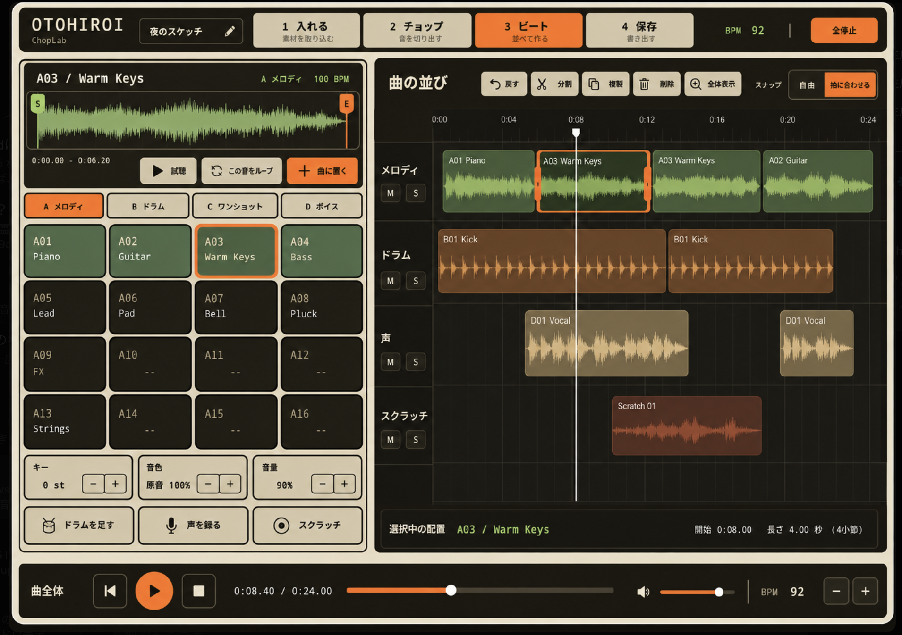
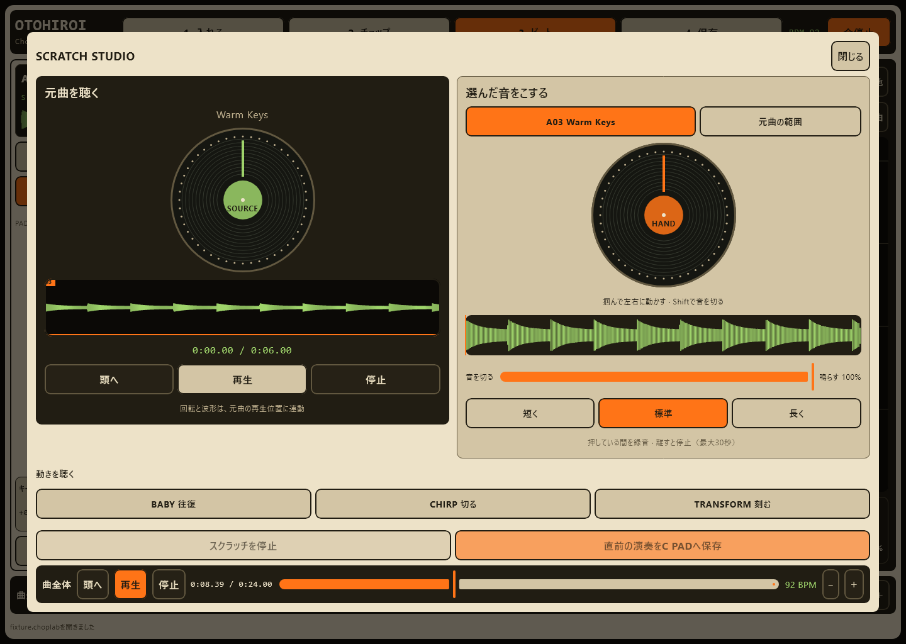

# 画面と操作の契約

2026-09-25のユーザー訂正により、8月版の楽器UIにClipchamp風の自由配置を組み込んだ編集構成とChopLabの見た目・操作感を維持します。5画面カード型への変更案は採用しません。0.18.0をコードの出発点とする判断と、共有タスクで選択した案2の改訂版を視覚・操作の基準とする判断は別です。進捗は [ROADMAP](ROADMAP.md)、機能は [PRODUCT](PRODUCT.md) が正本です。

## 再構築の構成

基準はユーザーが共有したタスク「Choplab UIを改善」で選択した案2と、その原曲連携・音量・可変幅の改訂版です。8月版の「1 入れる / 2 チョップ / 3 ビート / 4 保存」、大きい正方形PAD、濃い波形面、はっきりした枠と選択色を維持します。9月21日の素材棚中心の全面タイムラインを基準にする解釈は撤回しました。5画面カード型への再編も採用しません。

- 1 入れる: 取り込んだ原曲の波形・再生・キー・原曲音量を、その画面で扱う。取込完了だけで別工程へ強制遷移しない。
- 2 チョップ: 元音全体・範囲・切れ目とPADへの割当を中心に、原曲試聴・音量を保つ。
- 3 ビート: 上段に原曲専用の波形・試聴・音量を固定。左の明るい楽器面に選択PADの濃い波形、試聴・ループ・曲へ置く、BANK、4×4の正方形PAD、キー・音色・音量、ドラム・声・スクラッチをまとめる。右の濃い配置面へClipchamp風の連続マルチトラック、移動・伸縮・分割・複製・削除、トラック音量/muteを組み込む。PADと配置を同時に扱え、どちらかだけの別アプリにしない。
- 4 保存: 編集を続ける制作ファイルと、音声として聴く・渡すWAVを読み分けられる。曲全体の再生操作も維持する。

1・2・3で同じ原曲と再生位置・音量を共有し、工程移動だけで原曲を止めない。PAD選択で原曲表示を入れ替えず、原曲と選択PADを同時に見せる。「同じ原曲を3でも見たり聴いたい」という要求を、原曲の自動配置に読み替えない。

3の最下部は曲全体の頭出し・再生・停止・シーク・再生音量。原曲音量と曲全体の再生音量は試聴用で、PAD・トラック・書出し音量と区別する。左右境界は標準比率を初期値にドラッグで調整でき、標準幅ボタンまたはダブルクリックで戻せる。狭い画面はPAD/配置の切替とスクロールを使い、正方形PADと主要操作を保つ。 広い画面では上下の操作欄の実測高を予約し、残りの幅と高さへ4×4 PADを収める。通常表示はPAD詳細を折り畳み、選択音の波形・配置・Fill・試聴は名前付きの詳細ボタンから開く。狭い画面の原曲と楽器面は同じ縦スクロールに置き、全停止と曲transportは固定する。拡大文字で工程を変えた場合は選択工程を見える位置へ移す。

ボーカル・歌詞・ミックス・FXはこの編集構成の文脈から開く補助編集として追加する。スクラッチは原曲の再生面と手で操作する面、独立フェーダーを区別する。新機能を理由に全体の配置・見た目・操作体系を再編しない。

視覚基準は2026-09-27に利用者が改めて提示したビート画面と、左右2円盤のscratch画像です。ビートは左に幅を使った大きな4×4 PADと選択音のS/E波形・BANK・音色操作、右に広い濃色の連続マルチトラックと編集操作、最下部に曲全体transportと音量を置く。クリーム色の枠と操作面、橙の選択・主要操作、緑の音源波形を保つ。同時に転送された旧取り込み画像と旧ビート画像は利用者の訂正により参照から外す。画像の見た目と、その後に明文化された原曲共通表示・試聴音量・可変幅・A–H×16の契約を組み合わせる。画像は新実装の音・端末・Human受入の証拠ではない。参照タスクのコード・制作データは保全する。

### 承認済み画像（設計参照）

BEATは2026-09-27の最終指定、scratchは元セッションで指定された左右2円盤の参照を保存した。取り下げられた2枚目・3枚目の画像は含めない。これらは操作構成の参照であり、現行アプリの完成画像ではない。画像内のBANK数・文言・音源名は例示であり、A–H×16、ja/en切替、原曲共通監視・独立音量・可変dividerの書面契約を削らない。

scratchは左SOURCEで原曲の再生位置・波形・再生/停止を確認し、右HANDで選択PADまたは原曲範囲をこする。SOURCE/HANDの音量とCUTを区別し、同時に使える独立した音声経路・操作所有を検証する。原曲HANDを動かしてもSOURCEの再生は続き、左右のcursorを強制同期させない。手を離す・取消・画面移動はHANDだけを一度解放し、SOURCEをseek・再開しない。PADをつかむ既存経路は有効な先行PAD再生だけを一度復帰させる。原曲HANDはnative frameと静止位置を表示し、390px・文字2倍でもスクロール可能な2円盤と固定停止を保つ。各経路の実装と受入はROADMAPで管理する。

## 見た目と言葉

CHOPの自動チョップは既存工程から補助窓を開き、選択範囲・等分/アタック検出・区間数/上限・最小音量・最小間隔を確認して候補を作る。前後の区間と範囲表示、区間試聴・停止、明示適用・取消を保ち、候補生成だけでPADや切れ目を変更しない。適用済みの切れ目は原曲波形へ表示し、選んだ区間を示したBANK/PADへ割り当てる。保存再開後も同じ切れ目へ戻れる。390px・文字2倍でも設定と停止・適用・取消へ到達できるようにする。

焦げorange `#8A3D00`、orange `#FFB15E` / `#FF7A1A`、green `#577D32`、cream `#EFE6D0`、dark `#14110A`を出発点に、柔らかい角丸と読みやすい階層を保ちます。本文14–16sp、主button16sp以上を基本とし、文字contrast4.5:1以上、主要操作48dp以上を確認します。色だけで選択・録音・errorを伝えません。

日本語「おとひろい」、英語「Earth Song」。新UIはja/en resourcesを使い、日英2段ラベルを廃止します。coreのtyped NoticeをUIで翻訳し、文言による制御分岐を作りません。Material Symbolsを採る場合はlicenseをNOTICEへ追加します。AKAI/MPCのロゴ・固有の外観・assetは使いません。

## 維持する操作の意味

- 復旧中はLOADING。新規と復元済みを区別し、読み込んだ制作へstarter kitを勝手に足さない。
- PAD identity、選択、BANKを一度に更新。割当/再生拒否なら成功状態や遷移へ進まない。
- scroll中のPAD誤爆を防ぎ、tap・hold・GATEの所有とcancelを明確にする。pressの所有はnavigation/cancelでも一度だけ解放。現行の基準は [ADR5](adr/ADR-0005-guided-first-screen-flow.md)。
- 空PADの編集やbusy中の破壊操作を受付けず、拒否理由を示す。変更確認は対象内容と期限に結び付け、選択変更後に古い確認を使わない。
- 調整は示しているPADへ適用し、Undoを保つ。PAD scratch終了は有効な先行PAD再生へ一度だけ復帰し、先行再生がなければ止まる。原曲HANDの終了は独立したSOURCE再生を変更しない。
- Source/PAD/Beatや録音のstatusを実際の状態に合わせる。metadata、ダウンロード、decode、保存成功を同じ「追加済み」にしない。

## 確認する画面と入力

スマホ縦/横、tablet、Windows、font scale1.0/1.3/2.0、狭い幅/高さで、全操作へ到達・scroll・focus・keyboard・48dp・ラベル切れを確認します。画像はsame stateで比較し、ImageComposeSceneのPNGと入力testをセットにします。

PAD semanticsは完全なBANK/PAD名、割当、play mode、content kindを保持します。sliderの値・増減、checked state、disabled理由、statusの全文にも到達可能にします。Windowsのnative menu/dialogはWindowsで、TalkBackの読み上げ/順序は実機で確認します。PNGやsemantics callbackを人間の操作感・音・読み上げの代用にしません。

LiveChopのタイミング設定もCHOP内の補助窓に置く。出力推定/手動合計遅延を選び、1ms補正、適用・取消・全停止を大きい操作対象で示す。`ESTIMATED`/`MANUAL`と不明・変更時の失効を表示し、実測済みの表示を作らない。設定は文書やUndoを変更せず、押下時の読み取りをreleaseまで保持して、スクロール取消や古いpassの押下を切断へ変えない。4工程・大PAD・原曲SOURCE/HANDは維持する。
